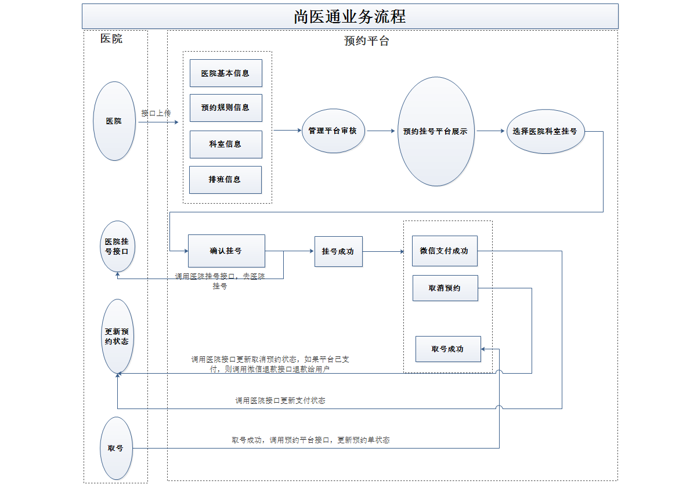
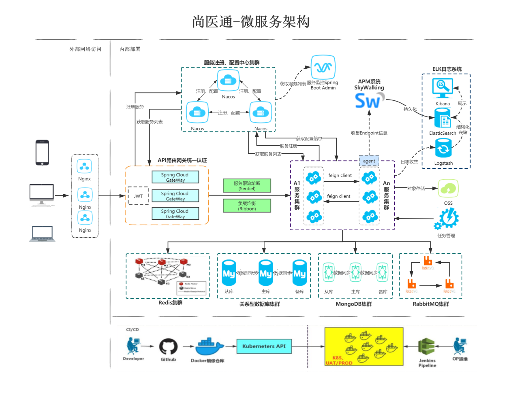

<!-- PROJECT LOGO -->
 

  

<h3 align="center">ForumDent Online Appointment and Registeration Service</h3>

  

    <a href="https://www.forumdent.com"><strong>More about ForumDent »</strong></a>
     
     
    <a href="https://github.com/165-Softtech-Patika-Java-Spring/bitirmeprojesi-UyCoder/blob/main/BitirmeProjesiTalepleri.md">Project Requirements</a>
    ·
    <a href="https://github.com/165-Softtech-Patika-Java-Spring/bitirmeprojesi-UyCoder/blob/main/BitirmeProjesiHazirlikDokumani.pdf">Project Prapration Doc</a>
    ·
    <a href="https://github.com/othneildrew/Best-README-Template/issues">View Demo</a>
  

# 1. Introduction
This is a project about online appointment and registration system. Online appointment and registration is a convenient medical treatment service developed in recent years. It aims to alleviate the difficulty of seeing and registering a doctor.
Many patients have to go to the hospital many times to see a doctor. But there is no guarantee that they will see the doctor any time they want.
The online appointment and registration service could solves this medical problem. Register easily anytime, anywhere! No need to wait in the queue lines!

# 2. What did I learn from this project?

- Consolidate previous technical knowledges
- Learn real-world usage of the technical knowledges
- Master the business process of appointment registration

# 3. Core Technologies
### Back-end technologies
- SpringBoot
- SpringCloud
- MyBatis-Plus
- Redis
- RabbitMQ
- HTTPClient
- Swagger2
- Nginx
- Lombok
- Mysql
- MongoDB
### Front-end technologies
- Vue.js
- Node.js
- Axios
- NPM
- Babel
- Webpack
### Other technologies
- Docker
- Git
- Jenkins

# 4. Business Process

# 5. Service Architecture

0000\000\\

https://teams.microsoft.com/dl/launcher/launcher.html?url=%2F_%23%2Fl%2Fmeetup-join%2F19%3Ameeting_ODQxNmExYzAtOWNiNS00YjAxLThkMWQtNGZhNjQ3YjdkNWI5%40thread.v2%2F0%3Fcontext%3D%257b%2522Tid%2522%253a%252268283f3b-8487-4c86-adb3-a5228f18b893%2522%252c%2522Oid%2522%253a%252222e25672-1888-4378-bad1-347047462ecf%2522%257d%26anon%3Dtrue&type=meetup-join&deeplinkId=3757dc14-7786-467f-aec7-4dc2c4ec7fc4&directDl=true&msLaunch=true&enableMobilePage=true&suppressPrompt=true

------

